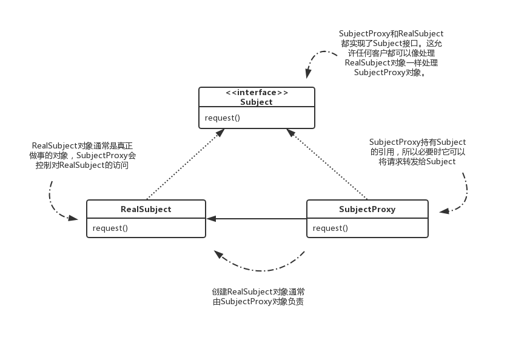
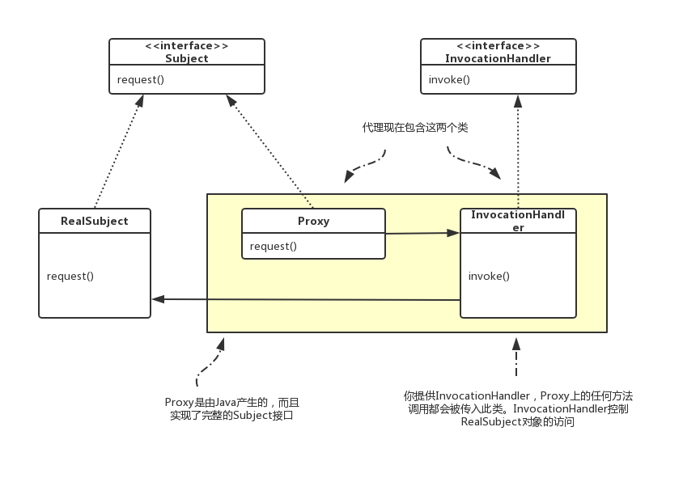

&emsp;&emsp;代理模式为一个对象提供一个代理对象来控制对这个对象的访问。所谓代理（Proxy），就是代表某个真实的对象。  
&emsp;&emsp;代理分为静态代理和动态代理。静态代理是在编译时就将接口、实现类、代理类全部手动完成；动态代理可以在程序运行期间根据需要动态的创建代理类及其实例，来完成具体的功能。

<!--more-->
## 静态代理
&emsp;&emsp;首先创建一个接口，然后创建具体实现类来实现这个接口，再创建一个代理类同样实现这个接口，不同之处在于，具体实现类中的方法需要将业务逻辑功能实现，而代理类中的方法只需要调用具体类中的对应方法，这样我们在需要使用接口中的某个方法的功能时直接调用代理类的方法即可。类图图下所示。



### 例子：  
1.定义接口Subject  
```JAVA
public interface Subject {

    void setName(String name);

    String getName();
}
```
2.创建具体实现类RealSubject  
```JAVA
public class RealSubject implements Subject {

    private String name;

    @Override
    public void setName(String name) {
        System.out.println("Named " + name);
        this.name = name;
    }

    @Override
    public String getName() {
        System.out.println("Name is " + this.name);
        return this.name;
    }
}
```
3.创建代理类SubjectProxy  
```JAVA
public class ProxySubject implements Subject {

    private Subject subject = new RealSubject();

    @Override
    public void setName(String name) {
        System.out.println("setName --- 前置操作");
        subject.setName(name);
        System.out.println("setName --- 后置操作");
    }

    @Override
    public String getName() {
        System.out.println("getName --- 前置操作");
        String name = subject.getName();
        System.out.println("getName --- 后置操作");
        return name;
    }
}
```
4.测试  
```JAVA
public class StaticProxyTest {

    public static void main(String[] args) {
        Subject subject = new ProxySubject();
        subject.setName("大大");
        System.out.println("=================");
        subject.getName();
    }

}
```
5.运行结果  
```
setName --- 前置操作
Named 大大
setName --- 后置操作
=================
getName --- 前置操作
Name is 大大
getName --- 后置操作
```

## 动态代理
&emsp;&emsp;在静态代理中，一个代理只能代理一种类型，而且是在编译时就已经确定被代理的对象。而动态代理是在运行时，通过反射机制实现动态代理，并且能够代理各种类型的对象。  
&emsp;&emsp;在Java中要想实现动态代理机制，需要java.lang.reflect.InvocationHandler接口和 java.lang.reflect.Proxy 类的支持。类图图下所示。



### 例子：
1.定义接口Subject  
```JAVA
public interface Subject {

    void doSports(String SportName);
}
```
2.创建具体实现类RealSubject  
```JAVA
public class RealSubject implements Subject {

    @Override
    public void doSports(String sportName) {
        System.out.println("开始：" + sportName);
    }

}
```
3.创建实现InvocationHandler接口的代理类  
```JAVA
public class PlaygroundInvocationHandler implements InvocationHandler {

    private String canDo;

    private Object object;

    public PlaygroundInvocationHandler(Object object, String canDo) {
        this.object = object;
        this.canDo = canDo;
    }

    @Override
    public Object invoke(Object proxy, Method method, Object[] args) throws Throwable {
        String willDo = null;
        if (args != null && args.length > 0) {
            willDo = (String) args[0];
        }
        if (canDo.equals(willDo)) {
            return method.invoke(object, args);
        }
        throw new RuntimeException("该场地不允许" + willDo);
    }
}
```
4.测试  
```JAVA
public class DynamicProxyTest {

    public static void main(String[] args) {
        Subject subject = new RealSubject();
        InvocationHandler bc = new PlaygroundInvocationHandler(subject, "打篮球");
        Subject bcProxy = (Subject) Proxy.newProxyInstance(subject.getClass().getClassLoader(),
                subject.getClass().getInterfaces(),
                bc);
        bcProxy.doSports("打篮球");
        try {
            bcProxy.doSports("踢足球");
        } catch (Exception e) {
            System.out.println(e.getMessage());
        }
        System.out.println("=========================");
        InvocationHandler ff = new PlaygroundInvocationHandler(subject, "踢足球");
        Subject ffProxy = (Subject) Proxy.newProxyInstance(subject.getClass().getClassLoader(),
                subject.getClass().getInterfaces(),
                ff);
        try {
            ffProxy.doSports("打篮球");
        } catch (Exception e) {
            System.out.println(e.getMessage());
        }
        ffProxy.doSports("踢足球");
    }
}
```
5.运行结果  
```
开始：打篮球
该场地不允许踢足球
=========================
该场地不允许打篮球
开始：踢足球
```

## 示例代码：
[Proxy Demo](https://github.com/Dfghhj/ProxyDemo)

## 参考：
- 《Head First设计模式(中文版)》第11章
- [java静态代理与动态代理简单分析](https://www.cnblogs.com/V1haoge/p/5860749.html)