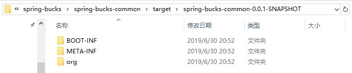

&emsp;&emsp;这几天用Maven构建了一个项目，包含了几个Modules，写了一些初始化的代码后，第一次运行"mvn clean install"的时候，却报错了。。Compilation failure......

<!--more-->
控制台报错如下：
```JAVA
[ERROR] Failed to execute goal org.apache.maven.plugins:maven-compiler-plugin:3.8.1:compile (default-compile) on project spring-bucks-data: Compilation failure: Compilation failure: 
[ERROR] /E:/workspace/spring-bucks/spring-bucks-data/src/main/java/top/dfghhj/springbucks/data/model/CoffeeOrder.java:[4,46] 程序包top.dfghhj.springbucks.common.constant不存在
[ERROR] /E:/workspace/spring-bucks/spring-bucks-data/src/main/java/top/dfghhj/springbucks/data/model/CoffeeOrder.java:[15,1] 找不到符号
[ERROR]   符号:   类 OrderState
[ERROR]   位置: 类 top.dfghhj.springbucks.data.model.CoffeeOrder
[ERROR] /E:/workspace/spring-bucks/spring-bucks-data/src/main/java/top/dfghhj/springbucks/data/model/CoffeeOrder.java:[16,1] 找不到符号
[ERROR]   符号:   类 OrderState
[ERROR]   位置: 类 top.dfghhj.springbucks.data.model.CoffeeOrder.CoffeeOrderBuilder
[ERROR] -> [Help 1]
```
刚开始以为是不同模块之间的引用写错了，检查后发现并没有问题。这种怪异的情况第一次遇到，百思不得其解，然后就去百度了...

&emsp;&emsp;最后发现是pom.xml中的spring-boot-maven-plugin插件的原因，因为几个Modules都是SpringBoot的工程，通过脚手架生成出来在pom.xml中都会默认添加spring-boot-maven-plugin插件。

```JAVA
    <build>
        <plugins>
            <plugin>
                <groupId>org.springframework.boot</groupId>
                <artifactId>spring-boot-maven-plugin</artifactId>
            </plugin>
        </plugins>
    </build>
```

&emsp;&emsp;spring-boot-maven-plugin的主要作用就是把项目打包成可执行的jar包。  

&emsp;&emsp;做个简单的实验，一个是有spring-boot-maven-plugin插件的情况下运行"mvn package",一个是没有spring-boot-maven-plugin插件的情况下运行"mvn package"，最后查看两者打包出来的jar的结构。

有spring-boot-maven-plugin插件情况下：  
  

没有spring-boot-maven-plugin插件情况下：  
  

&emsp;&emsp;对比了jar包的结构，基本可以确定就是spring-boot-maven-plugin插件的原因。spring-boot-maven-plugin插件打包后所有的包和类都放到了BOOT-INF文件夹中，而一般方式打包出来的包和类都在根路径下面。解决方案有二：

1.如果不需通过运行jar来启动程序的话，可以把spring-boot-maven-plugin插件删除，使用maven默认的打包方式；
  
2.修改spring-boot-maven-plugin插件配置项： 

```JAVA
    <plugin>
        <groupId>org.springframework.boot</groupId>
        <artifactId>spring-boot-maven-plugin</artifactId>
        <configuration>
            <classifier>exec</classifier>
        </configuration>
    </plugin>
```

"<classifier>exec</classifier>"的作用是为spring-boot-maven-plugin打出来的jar包添加"exec"后缀以区分两个不同的jar包。


参考：
- [Spring Boot Reference Guide](https://docs.spring.io/spring-boot/docs/2.1.6.RELEASE/reference/html/howto-build.html#howto-create-a-nonexecutable-jar)
- [Spring Boot Maven Plugin](https://docs.spring.io/spring-boot/docs/2.1.6.RELEASE/maven-plugin/examples/repackage-classifier.html)